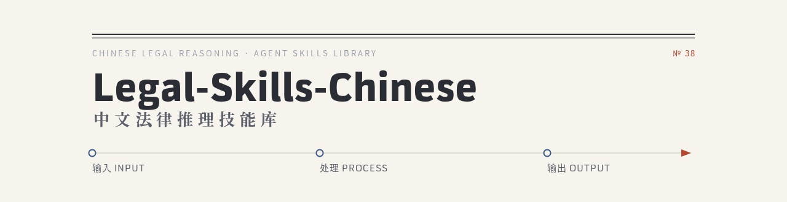

<div align="center">



</div>

<br>

<div align="center">

[](https://awesome.re)
[](#-技能总览--skill-index)
[](#-设计理念--design-philosophy)
[](#-免责声明--disclaimer)
[](#-贡献--submit-a-new-skill)
[](#-许可与责任--license)

**38 个由执业法律专业人员手写并验证的法律推理技能(Agent Skills),覆盖检索 → 推理 → 论证 → 文书的完整链条。**

*A curated library of 38 hand-crafted, lawyer-verified legal reasoning skills for PRC statutory law.*

[技能总览](#-技能总览--skill-index) ·
[设计理念](#-设计理念--design-philosophy) ·
[评测覆盖](#-覆盖的评测任务--benchmark-coverage) ·
[使用方式](#-使用方式--usage) ·
[贡献技能](#-贡献--submit-a-new-skill)

</div>


> [!WARNING]
> ### ⚠️ 免责声明 · Disclaimer
>
> 本技能库是**辅助**法律工作者进行分析的工具,**不提供法律意见、不构成法律结论、不能替代律师**。每一项技能的输出都应被视为**供执业法律专业人员审阅的草稿**,而非可直接对外使用或据以作出决定的成果。
>
> - 技能中的检查清单、分析框架、风险提示,以及对法条或裁判规则的归纳,都只是辅助审阅者本人判断的工具,不代表本项目对法律的立场。
> - 本库默认面向**中国大陆成文法体系**。在成文法体系下,案例不具有普遍约束力(最高人民法院指导性案例除外);类比推理在刑法定罪量刑、税法课税要件等领域受严格限制甚至禁止。涉及其他法域(港澳台、普通法系等)时,使用者必须自行调整相应技能的法律前提。
> - AI 生成的推理与结论可能存在偏差、遗漏或过时。**最终的法律判断必须由具备执业资格的法律专业人员作出,并由其承担相应责任。**


## 🧭 设计理念 · Design Philosophy

这套技能库不是一堆零散的提示词,而是一个**分层的法律推理体系**。

<table>
<tr>
<td width="50%" valign="top">

#### 🧩 原子能力 × 36

每个技能只做一件事:检索一条法条、提取一组要素、完成一次演绎、评估一段论证的强度。

它们是可独立调用、可相互组合的**最小单元**。

</td>
<td width="50%" valign="top">

#### 🎼 复合能力 × 2 ✦

`judgment-document-generation`(裁判文书生成)与 `legal-judgment-prediction`(法律判决预测)是**编排层**。

它们本身不引入新能力,而是按固定主线调度多个原子能力,完成端到端复杂任务。

</td>
</tr>
</table>

复合能力的固定调度主线:

```
事实要素提取 → 概念理解 → 争议识别 → 法条检索 → 案例检索 → 演绎推理 → 格式适用 → 术语规范
```

每个 `SKILL.md` 都自带:**触发条件 · 能力边界 · 操作步骤 · 输入/输出格式 · 法律声明**。复合能力会显式说明它调用了哪些原子能力以及调用顺序。

> 💡 **为什么强调"手写"?** 这些技能均由执业法律专业人员逐一手写并验证,力求精确贴合中国法律的推理逻辑与实务规范,而非由模型自动生成的泛化提示词。


## 📚 技能总览 · Skill Index

38 个技能按功能分为 **7 类**,对应法律工作的「输入 → 处理 → 输出」三层。

| 类别 | <span style="white-space:nowrap">数量</span> | 技能 |
|:---|:---:|:---|
| <span style="white-space:nowrap">**01 · 信息检索**</span> | 5 | `case-retrieval` · `legal-article-retrieval` · `other-legal-retrieval` · `legal-norm-validity-check` · `legal-concept-comprehension` |
| <span style="white-space:nowrap">**02 · 事实与要素处理**</span> | 4 | `legal-element-extraction` · `structured-element-extraction` · `dispute-issue-identification` · `evidence-evaluation` |
| <span style="white-space:nowrap">**03 · 法律解释**</span> | 4 | `legal-interpretation-argument` · `systematic-interpretation` · `teleological-interpretation` · `normative-meaning-argumentation` |
| <span style="white-space:nowrap">**04 · 法律推理**</span> | 7 | `deductive-reasoning` · `inductive-reasoning` · `analogical-reasoning` · `legal-abductive-reasoning` · `counterfactual-reasoning` · `formal-legal-consequence` · `conflict-resolution` |
| <span style="white-space:nowrap">**05 · 论证组织与评估**</span> | 4 | `argument-chain-construction` · `argument-strength-evaluation` · `evidence-argument-chain` · `strategic-risk-prioritization` |
| <span style="white-space:nowrap">**06 · 风险评估与价值判断**</span> | 6 | `dispute-and-performance-risk` · `internal-compliance-risk-identification` · `legal-risk-assessment` · `judicial-value-judgment` · `administrative-value-judgment` · `legal-judgment-prediction` ✦ |
| <span style="white-space:nowrap">**07 · 文书与事务管理**</span> | 8 | `legal-document-formatting` · `judgment-document-generation` ✦ · `legal-document-summarization` · `multi-document-summarization` · `legal-terminology` · `case-lifecycle-planning` · `trial-scheduling-and-deadline-monitoring` · `billing-and-litigation-budget` |

> ✦ 标记为**复合能力**:`legal-judgment-prediction` 与 `judgment-document-generation` 在功能上分别归入「风险评估/预测」与「文书」类,但实现上是调度其他原子能力的编排层。

<br>


> **理论依据** 法律渊源理论(法律的表现形式与效力等级)· 规范层级理论(下位法不得抵触上位法)· 言语行为理论(识别话语背后的真实目的) — **参考** [Westlaw Edge](https://westlaw.com) · [Lex Machina](https://lexmachina.com)

[](./skills/case-retrieval)

查找与当前法律问题相关的类似案例、相关判决与裁判规则,支撑论点、预判结果、对比裁判立场。

[](./skills/legal-article-retrieval)

生成标准化法律检索报告,复核法律依据有效性,确认请求权/抗辩主张的法律依据,分析司法实践倾向。

[](./skills/other-legal-retrieval)

检索法条/司法解释/典型案例之外的辅助信息:立法背景、监管案例、地方指导意见、行业标准、学术通说、域外比较等。

[](./skills/legal-norm-validity-check)

对检索到的法条进行效力验证:现行有效、层级正确、与上位法及同位法无冲突,保障推理结论可靠。

[](./skills/legal-concept-comprehension)

解释、辨析、拆解法律概念,分析构成要件与法律效果,是法律分析的基础单元。

<br>


> **理论依据** 认识论(事实认定的哲学基础)· 构成要件理论 · 证据可采性理论(相关性、真实性、合法性)

[](./skills/legal-element-extraction)

从案件描述、聊天记录、媒体报道等非结构化文本中提取有法律意义的事实,将生活语言转化为法律语言。

[](./skills/structured-element-extraction) 

把法律问题/事实/条文分解为结构化要素清单,作为进入下游推理前的"质量闸门",确保无遗漏、可追溯。

[](./skills/dispute-issue-identification) 

在要素提取之后从法律事实中提取争议焦点,排除无争议事项,将案件关系转化为法律关系问题。

[](./skills/evidence-evaluation)

对证据的真实性、合法性、关联性("三性")及证明力评估,判断可采性、证明标准、补强建议与非法证据排除。


> **理论依据** 法律解释学(解释者与文本的视域融合)· 法教义学 · 文义/体系/目的解释构成有优先级的方法层级

[](./skills/legal-interpretation-argument)

综合运用文义、体系、目的解释,对含义模糊或存在适用争议的关键法条进行严谨的解释论证。

[](./skills/systematic-interpretation)

体系解释:依据规范在法律体系中的位置与关联规范,作出最符合体系性的解释。

[](./skills/teleological-interpretation)

目的解释:当文义解释无法择一时,发现并论证条文目的,在文本可承受范围内选择最正当的含义。

[](./skills/Normative-Meaning-Argumentation)

分析规范的目的与价值导向,判断事实如何进入规范评价及涵摄的限度。

<br>


> **理论依据** rule-based(三段论映射)与 case-based(比对先例异同)推理 · 输入-输出逻辑 · 可废止道义逻辑(义务/许可/禁止 + 例外推翻)· 可能世界语义学

[](./skills/deductive-reasoning)

基于形式逻辑的严密演绎,将非结构化法律规范与事实转化为可检验的三段论链条(P-F-C)。

[](./skills/inductive-reasoning)

从一个或多个具体案例、事实模式中提炼可推广的一般性法律规则、裁判规则或原则。

[](./skills/analogical-reasoning)

在法律漏洞情形下,识别相似性基础(tertium comparationis),论证类比正当性,得出结论。

[](./skills/Legal-Abductive-Reasoning)

在证据不完整、事实模糊时生成并评估最合理的解释性假设;结合米尔五法进行结构化因果推断。

[](./skills/counterfactual-reasoning)

评估"若某一事实/行为不存在,法律结果将如何不同",用于因果认定、责任比例、损害范围等。

[](./skills/formal-legal-consequence)

推理链的终端:从已确认事实与已匹配规范推导具体法律后果(责任、赔偿额、刑期、处罚、合同效力)。

[](./skills/conflict-resolution)

处理法条竞合、证据矛盾、争点优先级、法源冲突——几乎所有复杂法律分析都会触及的核心枢纽。

<br>


> **理论依据** 风险评估理论 · 预防原则 · 决策理论 · 法哲学(自然法/实证主义/现实主义)· 比例原则(适当性、必要性、均衡性三阶)· 公共利益理论

[](./skills/dispute-and-performance-risk) 

评估合同/交易中"是否会产生法律纠纷"与"是否存在违约风险",输出结构化风险清单与应对建议。

[](./skills/internal-compliance-risk-identification)

系统审查企业内部合规体系,覆盖制度完整性、流程控制有效性、个人信息保护三大维度。

[](./skills/legal-risk-assessment)

从许可资质、监管法规遵循及历史处罚记录维度,评估企业面临的监管处罚风险。

[](./skills/judicial-value-judgment)

辅助法官在权利冲突、法律不确定、比例原则审查等场景中,进行可审查、可论证的价值判断。

[](./skills/administrative-value-judgment)

辅助行政机关工作人员按行政法基本原则进行价值判断、利益衡量,形成倾向性裁量结论。

[](./skills/legal-judgment-prediction) 

**复合能力 ✦**:调度 8 个原子能力,预测罪名、适用法条、刑期及量刑情节,输出含置信度的结构化报告。


> **理论依据** Dung 抽象论辩框架(以攻击关系有向图量化论证强度)· 论证图式(附批判性问题)· Toulmin 论证模型(六要素、可废止性)· 多属性效用决策理论

[](./skills/argument-chain-construction)

将推理结果组织为完整、自洽、有说服力的论证结构,用于意见书、代理词、辩护词等。

[](./skills/argument-strength-evaluation) 

对一段已完成的推理作自我评估,给出强度/置信度评级,识别并标注链条中的薄弱环节。

[](./skills/evidence-argument-chain)

建立"主张→要件→证据→证明力评估"的完整映射,确保每个主张有充分证据、每项证据有明确目的。

[](./skills/strategic-risk-prioritization)

按发生概率与影响程度对多个风险点系统排序,帮助决策者在有限资源下作战略性取舍。

<br>


> **理论依据** 言语行为理论(确保文书言外行为效力准确)· AGM 信念修正理论 · 规范变更逻辑 · 运筹学与调度理论 · 法律信息降维与压缩理论

[](./skills/legal-document-formatting)

基于人民法院裁判文书制作规范,起草完整的民事/刑事判决书,起草中自主调用原子技能。

[](./skills/judgment-document-generation) 

**复合能力 ✦**:调度同一组原子能力,生成格式规范、论证严密的完整刑事判决书。

[](./skills/legal-document-summarization) 

对判决/裁定/调解/仲裁/行政处罚等文书作结构化摘要，忠实原文、客观、突出核心、避免复述全文。

[](./skills/multi-document-summarization) 

跨多份文档综合分析,提取共同观点、识别冲突、生成统一概览与新的综合性洞见。

[](./skills/legal-terminology)

确保法律文本术语措辞准确、无歧义、符合法律文体;贯穿所有法律文本生产环节的基础原子能力。

[](./skills/case-lifecycle-planning)

规划案件准备时间线,生成诉讼路线图与关键时间一览表。

[](./skills/trial-scheduling-and-deadline-monitoring)

跟踪并提醒开庭/执行排期、证据提交、上诉、送达、保全续保等各项法定期限。

[](./skills/billing-and-litigation-budget)

统计律师工时与各类费用,编制与监控预算,进行诉讼经济性分析,出具工时单/费用单。


## 🎯 覆盖的评测任务 · Benchmark Coverage

本库设计参照了中文法律 NLP 的主流评测基准。下表反映**方法论层面**的对应关系——即本库提供了完成该类任务所需的分析框架与步骤——并不代表已在相应数据集上做过定量评测或达到某一分数。

<details>
<summary><b>📊 LexEval</b> · 六大认知维度</summary>

<br>

| 认知维度 | 代表任务 | 对应技能 |
|:---|:---|:---|
| 记忆 Memorization | 法律概念、法条、法律演变 | `legal-concept-comprehension` · `legal-article-retrieval` · `legal-norm-validity-check` |
| 理解 Understanding | 法律关系/要素/争议焦点识别、文书摘要 | `legal-element-extraction` · `structured-element-extraction` · `dispute-issue-identification` · `legal-document-summarization` |
| 推理 Logic Inference | 法条适用/罪名/刑期预测、多跳推理、类案识别 | `deductive-reasoning` · `formal-legal-consequence` · `legal-judgment-prediction` ✦ · `case-retrieval` |
| 判别 Discrimination | 文书校对、咨询回答质量评估 | `argument-strength-evaluation` · `evidence-evaluation` |
| 生成 Generation | 文书生成、论辩挖掘、阅读理解 | `legal-document-formatting` · `judgment-document-generation` ✦ · `argument-chain-construction` |
| 伦理 Ethic | 法律伦理判断、偏见检测、隐私/歧视识别 | `judicial-value-judgment` · `administrative-value-judgment` |

</details>

<details>
<summary><b>📊 LawBench</b> · 三大认知层次</summary>

<br>

| 认知层次 | 代表任务 | 对应技能 |
|:---|:---|:---|
| 知识记忆 | 法条背诵、知识问答 | `legal-article-retrieval` · `legal-concept-comprehension` |
| 知识理解 | 文件校对、纠纷焦点识别、命名实体识别、事件检测、舆情摘要、论点挖掘 | `dispute-issue-identification` · `legal-element-extraction` · `legal-document-summarization` · `evidence-argument-chain` |
| 知识应用 | 法条/罪名/刑期预测、案例分析、犯罪金额计算、法律咨询 | `legal-judgment-prediction` ✦ · `formal-legal-consequence` · `deductive-reasoning` |

</details>

<details>
<summary><b>📊 CAIL（2018–2025)</b> · 中国法研杯</summary>

<br>

| 代表任务 | 对应技能 |
|:---|:---|
| 罪名预测 / 法条推荐 / 刑期预测 | `legal-judgment-prediction` ✦ · `formal-legal-consequence` · `deductive-reasoning` |
| 要素识别 / 法律要素和争议焦点识别 | `legal-element-extraction` · `structured-element-extraction` · `dispute-issue-identification` |
| 类案检索 / 相似案例匹配 / 可解释类案匹配 | `case-retrieval` · `analogical-reasoning` |
| 司法摘要 / 涉法舆情摘要 | `legal-document-summarization` · `multi-document-summarization` |
| 论辩挖掘 / 论辩理解 | `argument-chain-construction` · `evidence-argument-chain` |
| 裁判文书事实生成 / 说理生成 | `judgment-document-generation` ✦ · `legal-document-formatting` |
| 多人多罪判决预测 / 量刑情节识别与刑期预测 | `legal-judgment-prediction` ✦ · `conflict-resolution` |
| 法律数值计算(涉案金额/赔偿/利息) | `formal-legal-consequence` · `billing-and-litigation-budget` |
| 文书校对 / 事实认定 | `argument-strength-evaluation` · `legal-element-extraction` |

</details>

<details>
<summary><b>📊 其他基准</b> · JEC-QA / LeCaRD / MSLR / LAiW / JuDGE / CLAW / LeKUBE / LEVEN / AR-Bench / LegalAgentBench</summary>

<br>

| 基准 | 主要任务 | 对应技能 |
|:---|:---|:---|
| **JEC-QA** | 司法考试知识/案例问答 | `legal-concept-comprehension` · `deductive-reasoning` |
| **LeCaRD / v2** | 法律案例检索(排序) | `case-retrieval` · `analogical-reasoning` |
| **MSLR** | 基于 IRAC 的多步法律推理 | `deductive-reasoning` · `argument-chain-construction` |
| **LAiW** | 基于三段论的 NLU/推理/生成 | `deductive-reasoning` · `formal-legal-consequence` |
| **JuDGE** | 从事实生成完整判决书 | `judgment-document-generation` ✦ |
| **CLAW** | 条/款/项三级法条检索与分析 | `legal-article-retrieval` · `legal-norm-validity-check` |
| **LeKUBE** | 法律知识更新追踪 | `legal-norm-validity-check` |
| **LEVEN** | 法律事件检测、触发词识别 | `legal-element-extraction` |
| **AR-Bench** | 判决错误检测/分类/纠正 | `argument-strength-evaluation` · `evidence-evaluation` |
| **LegalAgentBench / J1-EVAL** | Agent 多步推理、工具调用、过程合规 | `legal-judgment-prediction` ✦ · `conflict-resolution` · `strategic-risk-prioritization` |

</details>


## 🚀 使用方式 · Usage

这些技能遵循 Anthropic Agent Skills 的 `SKILL.md` 约定,可在任何兼容该格式的环境中使用——例如 **Claude Code**、**Claude Cowork**,或其他兼容工具。

```text
1. 将需要的技能目录(skills/ 下任意目录)放入你的 skills 目录
2. 用自然语言描述法律任务 —— 模型会根据 description 中的触发条件匹配并调用相应技能
3. 复杂任务(生成完整判决书、预测判决)可直接触发复合能力,由其自动调度所需原子能力
4. ⚠️ 每一份输出都应经执业法律专业人员审阅后方可使用
```

### 🔌 接入真实数据库 · External Data via MCP

本库的检索类技能(`case-retrieval` · `legal-article-retrieval` · `legal-norm-validity-check`)**只定义检索方法论,不绑定任何数据库**。要让它们检索到**真实、现行、可溯源**的案例与法条(而非凭模型记忆),需为运行环境接入一个兼容 [MCP](https://modelcontextprotocol.io) 的法律数据服务。

技能对接口的要求极简——**只需环境中存在一个"输入检索词、返回结构化结果"的工具即可**,因此任何案例/法规库都可替换。目前已验证可用的是 **[北大法宝 MCP](https://mcp.pkulaw.com)**(1.6 亿+ 案例、500 万+ 法规)。配置只是在 MCP 客户端里加一个标准 Server:

```json
{
  "mcpServers": {
    "pkulaw": {
      "url": "https://apim-gw.pkulaw.com/{SERVICE_ID}/mcp",
      "headers": { "Authorization": "Bearer YOUR_TOKEN" }
    }
  }
}
```

> Token 与 `SERVICE_ID` 在 [mcp.pkulaw.com 控制台](https://mcp.pkulaw.com/console/apps) 获取,**只配置在你本地的客户端,切勿写进 SKILL.md 或提交到仓库**。
> 全部服务、链接与接入步骤见 [`MCP-PKULAW.md`](./MCP-PKULAW.md);各技能的接入契约见对应目录下的 `README.md`。
> ⚠️ 未接入任何数据库时,技能仍可运行,但所有案例/法条须标注 `[待检索]`/`[待查]`,绝不编造。

**目录结构:**

```text
Legal-Skills-Chinese/
├── README.md
├── CONTRIBUTING.md
├── MCP-PKULAW.md             # ← 北大法宝 MCP 全部服务与链接总表
├── assets/                   # README 视觉资产(banner、类别标签、技能标签 SVG)
├── skills/                   # 全部 38 个技能
│   ├── case-retrieval/
│   │   ├── SKILL.md          # 检索方法论(不绑定数据库)
│   │   └── README.md         # ← 北大法宝 MCP 接入说明(案例库)
│   ├── legal-article-retrieval/
│   │   ├── SKILL.md
│   │   └── README.md         # ← 接入说明(法规库)
│   ├── legal-norm-validity-check/
│   │   ├── SKILL.md
│   │   └── README.md         # ← 接入说明(法条溯源/修正幻觉)
│   ├── <其他技能名>/
│   │   └── SKILL.md          # 每个技能一个目录,一个 SKILL.md
│   └── ...
└── .github/ISSUE_TEMPLATE/
    └── submit-skill.yml
```

每个 `SKILL.md` 的开头是 YAML frontmatter:

```yaml
---
name: skill-slug          # 与目录名一致,小写连字符
description: |            # 触发条件、适用场景、能力边界
  ...
---
```

> 📝 **关于覆盖范围:** 本库只收录**已实现为 `SKILL.md` 的技能**。原始能力框架中尚有若干设想中的维度(如知识库/法条库构建、客户沟通与澄清式发问、危机预案与多场景模拟)尚未落地,待补齐后再行收录。


## 🤝 贡献 · Submit a New Skill

我们欢迎社区贡献新的法律技能。**无需精通 Git**——你可以直接提交,由维护者评审后并入。

<div align="center">

### 👉 [**点此提交一个新技能 · Submit a new Skill here!**](../../issues/new?template=submit-skill.yml)

</div>

**我们如何评审:**

1. **安全优先** —— 检查是否存在恶意代码、风险内容或不当依赖。
2. **法律质量** —— 由具备执业背景的评审者核查:触发条件是否清晰、能力边界是否准确、是否贴合中国大陆成文法的推理逻辑与实务规范。
3. **实用价值** —— 评估该技能是否真正为使用者带来可落地的帮助。

**提交一个技能,至少应包含:**

- 在 `skills/` 下新建一个以技能 slug 命名的目录(小写连字符)。
- 目录内一个 `SKILL.md`,开头为带 `name` 与 `description` 的 YAML frontmatter。
- `description` 中写清楚:**触发条件 · 适用场景 · 能力边界**。
- 如属编排型复合能力,请显式说明调用了哪些原子能力及调用顺序。

> 详细规范请参见 [`CONTRIBUTING.md`](./CONTRIBUTING.md)。


## 📄 许可与责任 · License

本列表与文档以 [**Creative Commons CC BY-NC-ND 4.0**](https://creativecommons.org/licenses/by-nc-nd/4.0/) 授权:你可以 fork、复制与再分发,但须保留署名;**不得分发修改版本,亦不得用于商业目的**。

本项目仅供法律研究与实务辅助之用。使用者须确保其使用方式符合所在法域对法律服务、执业资格与人工智能应用的相关规定。**任何对外的法律工作成果,其专业责任由使用该成果的执业人员承担,而非本项目或本项目的贡献者。**

## 🙏 致谢 · Acknowledgments

感谢 **Anthropic** 团队制定并开源了 Agent Skills 标准与示例,使本库得以站在其上构建。感谢每一位手写、验证并贡献技能的执业法律专业人员——你们是这套库专业性的来源。也感谢每一位 star、fork 或收藏本项目的朋友。

<div align="center">
<br>

**⚖️ 如果这个库对你有帮助,欢迎点一个 Star —— 它能帮助更多法律人和研究者发现它。**

</div>
